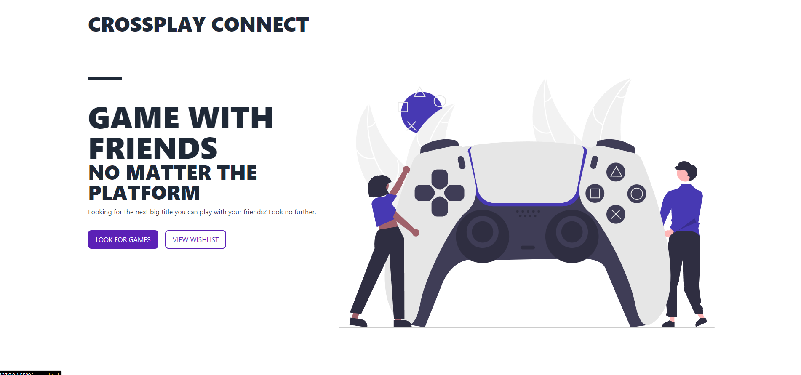
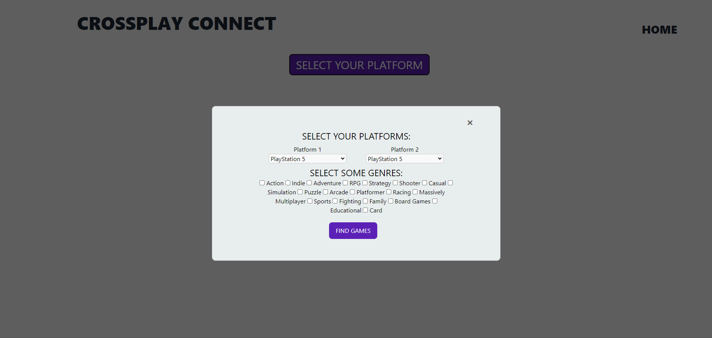
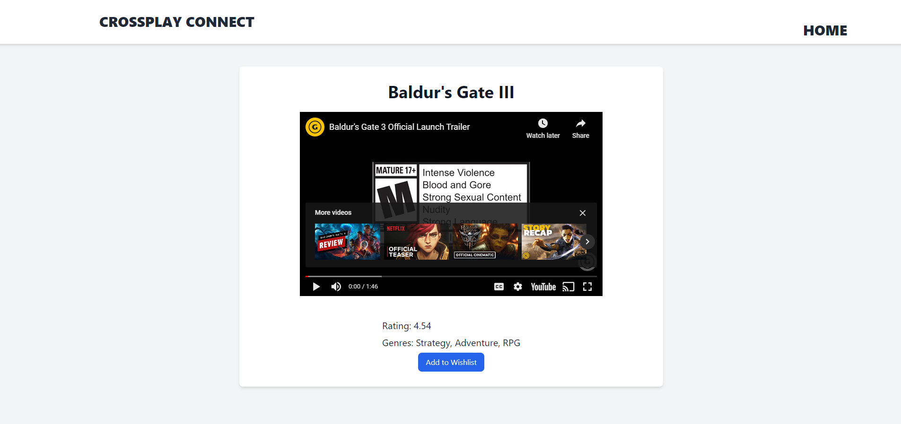
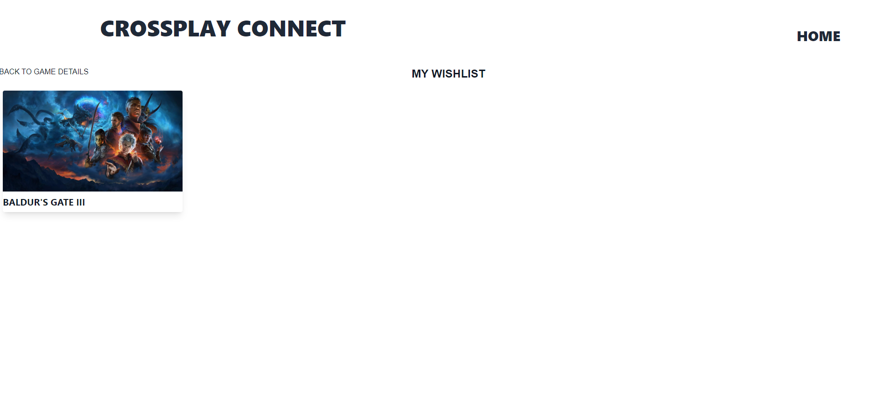

# Crossplay Connect

## Description
Imagine this: you've just gotten the latest chart-topping video game at your friend's recommendation. However, when you boot up your PC and hop onto call with your friend, you come to a depressing realization: your friend is on console, and the game doesn't offer cross-platform multiplayer!
Crossplay Connect is an interactive tool designed to provide the most popular, trending recommendations based on the platforms you're playing on. Selecting 2 different platforms will generate a list of the highest-rated games that offer cross-platform on both selected platforms, and allow you to check out the details of the game, as well as a trailer.

In creating this project, we learned about agile development and implementing its core values. We used a task board to keep track of progress and used Github for version control, giving us crucial experience in collaborating on projects in teams as well as adhering to a particular scope. Completing this project also allowed us to work with third-party APIs, parsing data and displaying it in HTML, and furthermore using CSS frameworks - in this case, we used Tailwind.

## Usage

Go [here](https://otekolste.github.io/crossplay-connect) to check it out!

To get started, click "get started." You'll be redirected to a new page. 

Click the "Select your platform", which will prompt a dialogue window to pop up.
Use the drop-down menus to select 2 platforms, then check some boxes to filter your results by genre.

A list of game titles will then be generated for you! All of the titles will be cross-platform and available on both of the selected platforms; they will also belong to at least one of the selected genres. They will be sorted by rating, starting with the highest.
Click on a game to be redirected to a new page, which will display details about the game itself, as well as have an embedded trailer that you can watch from the page itself.

On the bottom of that card, click "add to wishlist." You will be directed to the wishlist page which will contain the game you have just added!

You can repeat this as many times as you would like!

## Credits

### Server-side APIs used:

[YouTube Data API](https://developers.google.com/youtube/v3) for finding and embedding trailers into the webpage

[Youtube iFrame](https://developers.google.com/youtube/iframe_api_reference) referenced for embedding trailers into the webpage (check gamesPage.js for the location of the code)

[RAWG API](https://rawg.io/apidocs) for the video game data

### CSS

For styling, we made use of the [Tailwind](https://tailwindcss.com/) CSS framework 

The hero section was based off of [this template](https://tailwindflex.com/@prem/product-page) (see index.html for the specific code location)

## Images

The image on the homepage was sourced from [Undraw](https://undraw.co/)

## License

MIT license is available to view in the root of the directory, in the file entitled LICENSE.
